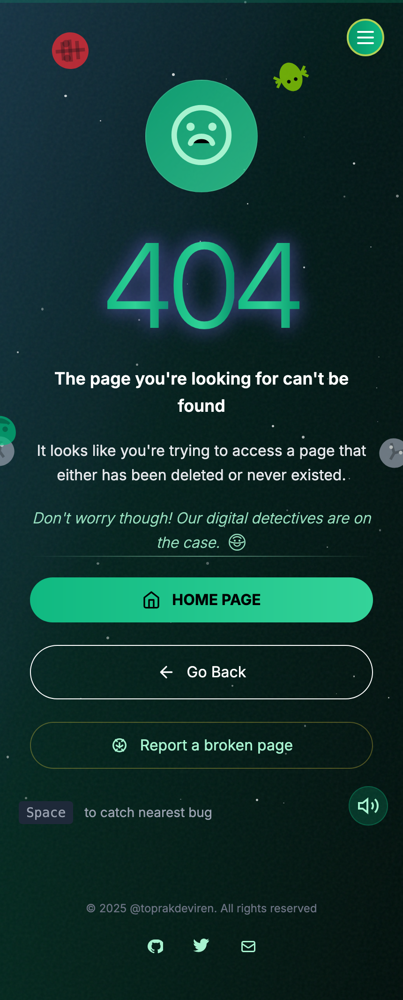

# 🐞 404 — Bug Hunt Adventure

An interactive, playful 404 page where you can catch bugs, level up, and debug your way through a digital adventure.




## 🚀 Features

- 🐞 Clickable bugs with score and level system
- 🎮 Keyboard support (Spacebar to catch nearest bug)
- 🌗 Light/dark mode toggle
- 🎨 Theme selector (e.g., Retro, Modern)
- 📱 Fully responsive (mobile + desktop)
- ⚙️ SVG sprite icons for fast loading
- 🔥 Easter eggs and animations

## 📦 Demo

[Live Demo](https://toprakdeviren.github.io/404-bug-hunt/)

## 🛠 Tech Stack

- HTML5 + Tailwind CSS
- Pure JavaScript
- SVG sprite system

## 🌍 Setup

```bash
git clone https://github.com/toprakdeviren/404-bug-hunt.git
cd 404-bug-hunt
open index.html